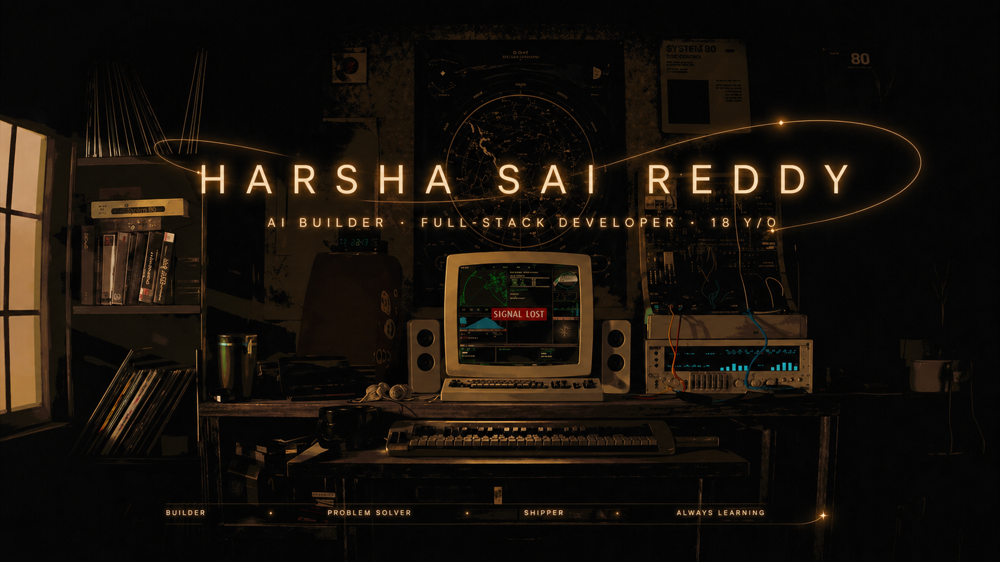

<div align="center">
  
</div>

<br/>

<div align="center">

[](https://harsha-portfolio-umber.vercel.app/)
[](https://postcraft-pro.vercel.app)
[](https://x.com/harshasai_reddy)
[](https://www.linkedin.com/in/harsha-sai-reddy-24b705404)
[](https://www.instagram.com/_harsha_sai_reddy_)

</div>

---

## ⚡ About Me

```python
harsha = {
    "age"        : 18,
    "location"   : "Andhra Pradesh, India 🇮🇳",
    "approach"   : "vibe coding — AI as creative co-pilot",
    "tools"      : ["Claude", "Cursor", "Emergent AI"],
    "stack"      : ["Next.js", "TypeScript", "Supabase", "Python"],
    "building"   : "CreatorStack 🎬 — LinkedIn for video creators",
    "researching": "DENA 🧠 — Distributed Expert Neural Architecture",
    "competing"  : "The Anvil Hackathon @ Scaler SST, Bengaluru 🏆",
    "open_to"    : ["hackathon teams", "collabs", "good problems"],
}
```

---

## 🚀 Projects

<div align="center">

| Project | Description | Stack | Status |
|---------|-------------|-------|--------|
| 🧠 **[DENA](https://github.com/harsha-sai-q/DENA)** | Distributed Expert Neural Architecture — modular AI research with dynamic routing, aggregation & memory | Python · Research | [](https://doi.org/10.5281/zenodo.19871653) |
| 🎬 **CreatorStack** | Professional network for video editors & motion designers — LinkedIn × Behance × Fiverr for the video economy | Next.js · Supabase · Cloudflare Stream |  |
| 🪄 **[PostCraft Pro](https://github.com/harsha-sai-q/postcraft-pro)** | AI LinkedIn post generator with competitor analysis & scoring | Next.js · Supabase · Sarvam · TypeScript | [](https://postcraft-pro.vercel.app) |
| 🖥️ **[Swabox](https://github.com/harsha-sai-q/Swabox)** | AI-integrated terminal with plugin system | Python · Docker · Rich |  |

</div>

---

## 🧠 Research

<div align="center">

### DENA — Distributed Expert Neural Architecture

</div>

**DENA** is an independent research project exploring how modular AI systems can route tasks to specialized expert subsystems instead of relying on a single dense model.

The architecture studies:
- **Task decomposition** — breaking queries into routable subtasks
- **Dynamic expert routing** — directing tasks to the right specialist
- **Weighted aggregation** — combining expert outputs intelligently
- **Verification + memory** — ensuring quality and learning over time

> **Status:** DENA v0 is a preliminary prototype using rule-based experts and controlled benchmarks. Results show measurable cost-aware routing but do not claim superiority over production MoE systems.

📄 **Paper:** `DENA: A System-Level Architecture for Distributed Expert AI Systems`
🔗 **DOI:** [10.5281/zenodo.19871653](https://doi.org/10.5281/zenodo.19871653)
📦 **Repo:** [harsha-sai-q/DENA](https://github.com/harsha-sai-q/DENA)

---

## 🛠️ Stack

<div align="center">


</div>

---

## 📊 Stats

<div align="center">


</div>

<div align="center">


</div>

<div align="center">


</div>

---

## 🎯 Right Now

```diff
+ researching →  DENA v0.3 — distributed expert neural architecture (published on Zenodo)
+ building    →  CreatorStack — professional network for video creators
+ competing   →  The Anvil Hackathon @ Scaler School of Technology, Bengaluru
+ learning    →  full-stack fundamentals · Git · prompt engineering
+ open        →  hackathon teams · collabs · interesting problems
```

---

<div align="center">
<sub>building different · shipping fast · always learning</sub>
</div>
